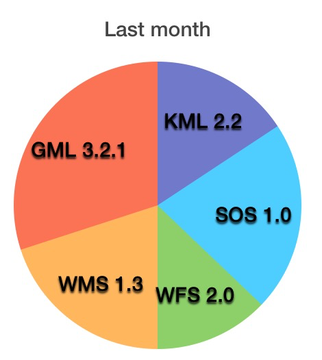

# TEAM Engine  Statistics
This repository provides code to get statistics reports about the tests being exercised in a TEAM Engine installation.

We exept to genereate reporets like the following

## Running the reporter

- First compile the AdminLogCreator.java file as: javac AdminLogCreator.java
- Then run javac AdminLogCreator.class file as: java AdminLogCreator ${path-of-user-folder}
