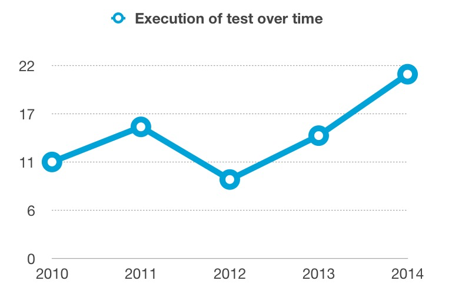

# TEAM Engine  Statistics
This repository provides code to get statistics reports about the tests being exercised in a TEAM Engine installation.


Currently reports look like the following:

```
Test Name: Catalogue Service - Web (CSW)_3.0.0
Last Month:21 | Last 3 Months:134 | Last Year:450 | All Times:1045
```


We expect to genereate reports like the following:





## Running the reporter

- First compile the AdminLogCreator.java file as: javac AdminLogCreator.java
- Then run javac AdminLogCreator.class file as: java AdminLogCreator ${path-of-user-folder}
